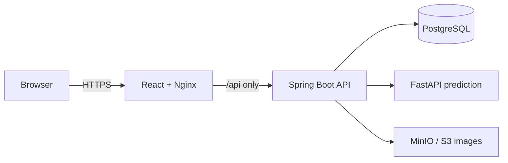

# AutoXP Phase 1 — hosting-ready foundation

## Scope

Phase 1 prepares a deployable platform without pretending that the Spring Boot
API already exists. It containers the working React and FastAPI services,
initializes PostgreSQL from versioned SQL, and defines the only database
contract the Phase 2 API may use.

## Target service boundary

Only the web container is publicly exposed in production. PostgreSQL, MinIO,
and the ML service stay on the private Docker network. The API is intentionally
not included in the default startup until its source exists; it is started with
the `api` Compose profile after its image is built.

## Database decisions

The SQL migrations live in `infrastructure/postgres/init/`.

- `brands` and `brand_models` are canonical reference data.
- `car_listings.brand_model_id` is mandatory; brand/model strings are not
  duplicated on a listing.
- `display_name` supports the UI; `ml_name` supports the current FastAPI model.
- Measurement and ownership fields are normalized (`engine_cc`, `max_power_bhp`,
  `owner_count`) and formatted only by the API/UI.
- `asking_price` remains separate from immutable `prediction_logs` records.
- `listing_images` supports galleries and stores only S3/MinIO metadata, never
  image bytes in PostgreSQL.
- `cities` and `states` prevent conflicting location strings.
- FK, check, unique, timestamp, and query indexes are part of the initial
  schema—not deferred application rules.

## Delivery sequence

1. Copy `.env.example` to `.env`; use unique secrets outside local development.
2. Start the Phase 1 dependencies with `docker compose up --build postgres ml-service minio`.
3. Verify migrations and reference data in PostgreSQL. Docker initialization SQL
   runs only on the first creation of the `postgres_data` volume.
4. Scaffold Spring Boot with Flyway and place future migrations under
   `backend/src/main/resources/db/migration`. Do not continue using
   `docker-entrypoint-initdb.d` after a persistent hosted database exists.
5. Build the API as the sole public business API: authentication, listing CRUD,
   signed image upload, saved cars, inquiries, and prediction proxy.
6. Start the full stack using an API image and `docker compose --profile api --profile frontend up --build`.
7. In production, use a managed PostgreSQL service and managed S3-compatible
   bucket where possible; keep the same tables and environment-variable names.

## API compatibility work for Phase 2

The React code currently expects shorthand listing fields (`km`, `fuel`,
`trans`, `owner`, `img`). The API must either return an explicit frontend DTO
with those names or the frontend must add one mapper. Do not expose JPA entities
directly.

The prediction API needs numeric input. The Spring API resolves a listing's
`brand_model_id` to its `ml_name`, converts normalized numeric fields, invokes
FastAPI, then records numeric results in `prediction_logs`. Formatted currency
strings are presentation-only and must not be persisted.

## Hosting rules

- Run database migrations in CI/CD before API rollout; never rely on automatic
  Hibernate schema generation in hosted environments.
- Terminate TLS at the hosting load balancer/reverse proxy and inject runtime
  secrets from its secret manager.
- Do not publish PostgreSQL, MinIO's S3 API, or FastAPI ports to the internet.
- Back up PostgreSQL and object storage independently, and test restoration.
- Use an immutable image tag per deployment and a health check for every service.
